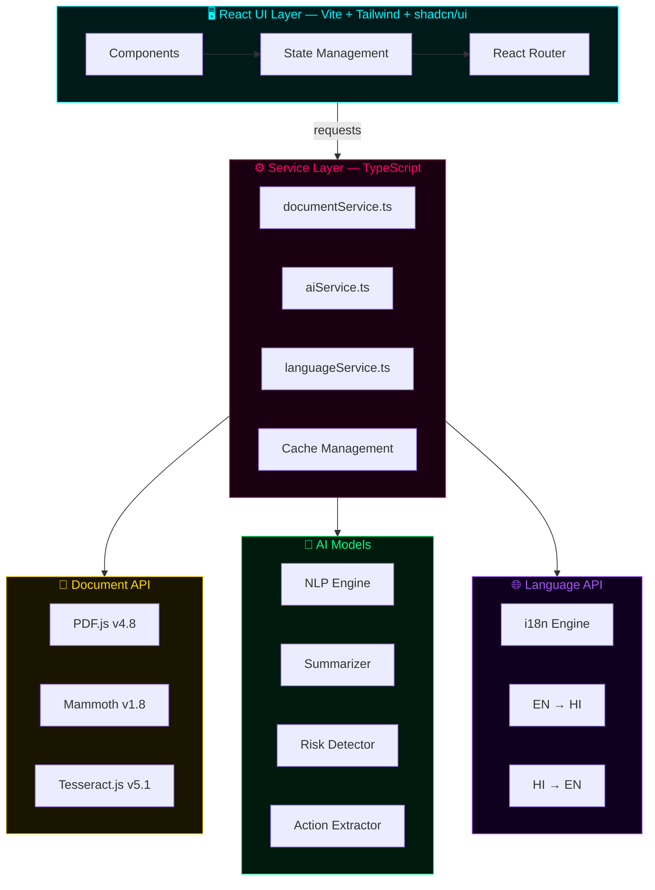
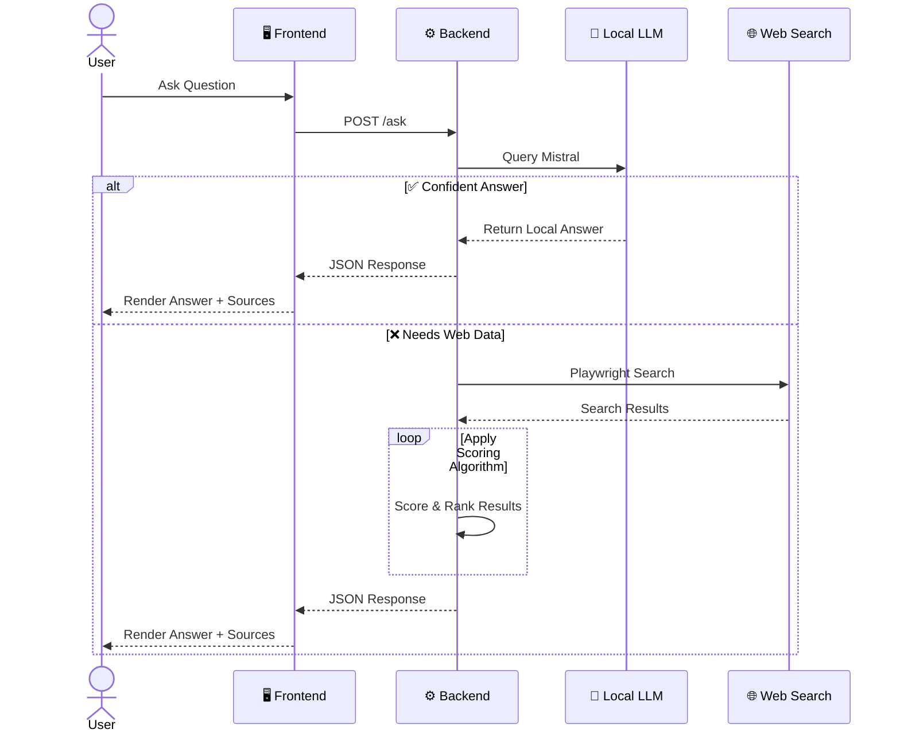
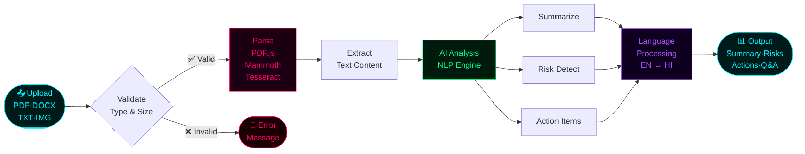
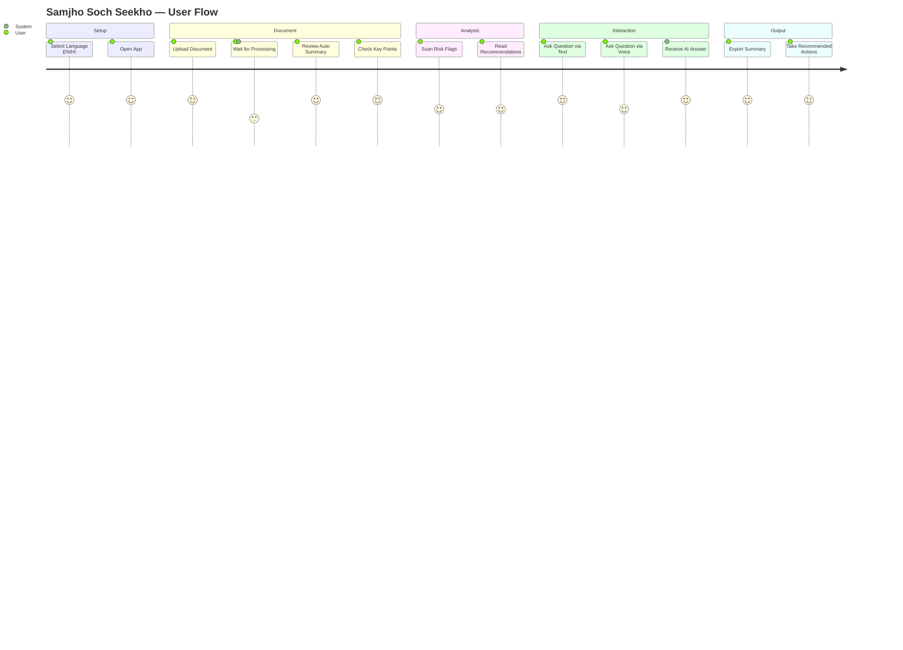
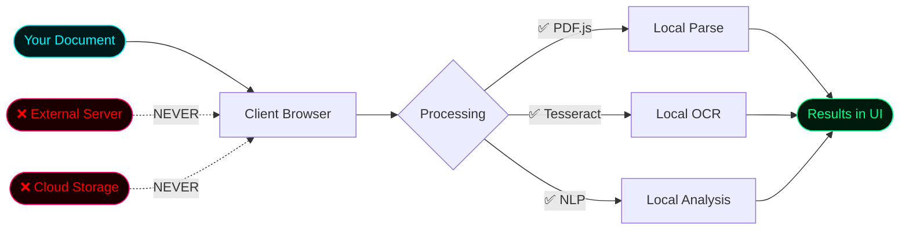
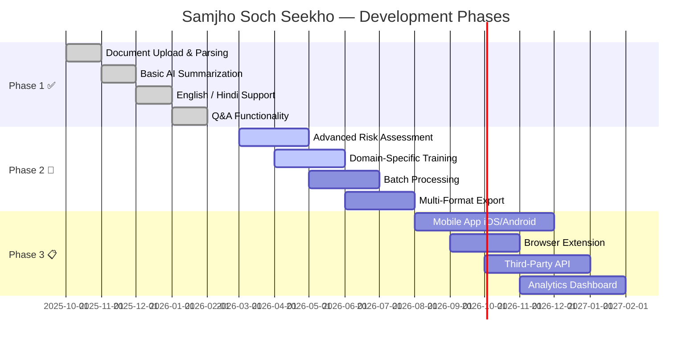

<div align="center">

<!-- HERO BANNER -->


<!-- BADGES -->


<br/>

> **🎓 Learning by Building** — Upload documents, unlock AI-powered insights, ask questions in English or Hindi.
> Privacy-first. Client-side. Blazingly fast.

<br/>

[📖 Live Demo](https://lovable.dev/projects/1779ca2d-62a0-4d6f-8d40-9b38844ccc6d) &nbsp;·&nbsp;
[🐛 Report Bug](https://github.com/AshmitThakur23/samjho-soch-seekho/issues) &nbsp;·&nbsp;
[✨ Request Feature](https://github.com/AshmitThakur23/samjho-soch-seekho/issues) &nbsp;·&nbsp;
[👤 Author](https://github.com/AshmitThakur23)

</div>

---

## 📋 Table of Contents

- [✨ Features](#-features)
- [🏗️ Architecture](#️-architecture)
- [🔄 Request Flow](#-request-flow)
- [⚡ Data Pipeline](#-data-pipeline)
- [🛠️ Tech Stack](#️-tech-stack)
- [📁 Project Structure](#-project-structure)
- [🚀 Quick Start](#-quick-start)
- [🔄 User Journey](#-user-journey)
- [🔐 Privacy & Security](#-privacy--security)
- [📈 Roadmap](#-roadmap)
- [🤝 Contributing](#-contributing)

---

## ✨ Features

<table>
<tr>
<td width="50%">

### 📄 Document Intelligence
- Upload **PDF, DOCX, TXT, Images**
- AI-powered content extraction & analysis
- Real-time parsing with **OCR** support
- Metadata preservation

</td>
<td width="50%">

### 🤖 Conversational AI
- Context-aware **Q&A chatbot**
- Multi-language: **English & Hindi**
- Natural language understanding
- Jargon → plain language translation

</td>
</tr>
<tr>
<td width="50%">

### 🚨 Risk Intelligence
- Auto-flagging of critical sections
- **Severity level** classification
- Actionable recommendations
- Prioritized next steps

</td>
<td width="50%">

### 🎙️ Voice & Accessibility
- **Speech-to-text** input
- **Text-to-speech** output
- Responsive: mobile · tablet · desktop
- WCAG-compliant components

</td>
</tr>
</table>

---

## 🏗️ Architecture



---

## 🔄 Request Flow



---

## ⚡ Data Pipeline



---

## 🛠️ Tech Stack

### Frontend Framework

| Tool | Version | Purpose |
|------|---------|---------|
|  **React** | `18.3+` | UI library with hooks & components |
|  **TypeScript** | `5.8+` | Type-safe JavaScript |
|  **Vite** | `5.4+` | Ultra-fast build tool with HMR |

### Styling & Components

| Tool | Version | Purpose |
|------|---------|---------|
|  **Tailwind CSS** | `3.4+` | Utility-first CSS framework |
| **shadcn/ui** | `latest` | Pre-built accessible components |
| **Lucide React** | `0.462+` | Icon library |

### Document Processing

| Library | Version | Purpose |
|---------|---------|---------|
| **PDF.js** | `4.8+` | PDF parsing & rendering |
| **Mammoth** | `1.8+` | DOCX document parsing |
| **Tesseract.js** | `5.1+` | OCR for scanned documents |

### AI & State Management

| Library | Version | Purpose |
|---------|---------|---------|
| **TanStack Query** | `5.83+` | Server state management |
| **Zod** | `3.25+` | Schema validation |
| **React Hook Form** | `7.61+` | Performant form handling |

---

## 📁 Project Structure

```
samjho-soch-seekho/
│
├── 📂 public/                  # Static assets
│
├── 📂 src/
│   ├── 📂 components/
│   │   ├── 📂 ui/              # shadcn/ui base components
│   │   ├── 📂 features/        # Feature-specific components
│   │   └── 📂 layout/          # Shell & layout components
│   │
│   ├── 📂 pages/               # Route-level page components
│   │
│   ├── 📂 services/
│   │   ├── 📄 documentService.ts   # PDF/DOCX parsing pipeline
│   │   ├── 📄 aiService.ts         # NLP, summarization, risk
│   │   └── 📄 languageService.ts   # EN ↔ HI translation
│   │
│   ├── 📂 hooks/               # Custom React hooks
│   ├── 📂 utils/               # Helper functions
│   ├── 📂 types/               # TypeScript type definitions
│   ├── 📄 App.tsx              # Root component
│   └── 📄 main.tsx             # Entry point
│
├── 📄 index.html               # HTML template
├── 📄 vite.config.ts           # Vite configuration
├── 📄 tailwind.config.ts       # Tailwind customization
├── 📄 tsconfig.json            # TypeScript config
└── 📄 package.json             # Dependencies & scripts
```

---

## 🚀 Quick Start

### Prerequisites

- **Node.js** v18+ / **Bun** runtime
- **npm** v9+ · **yarn** v3+ · or **bun**
- **Git**

### Installation

```bash
# 1. Clone the repository
git clone https://github.com/AshmitThakur23/samjho-soch-seekho.git
cd samjho-soch-seekho

# 2. Install dependencies
npm install        # or: yarn install / bun install

# 3. Start development server → http://localhost:5173
npm run dev

# 4. Build for production
npm run build

# 5. Preview production build
npm run preview

# 6. Lint
npm run lint
```

### Available Scripts

| Command | Description |
|---------|-------------|
| `npm run dev` | Start development server |
| `npm run build` | Build for production |
| `npm run build:dev` | Build in development mode |
| `npm run preview` | Preview production build |
| `npm run lint` | Run ESLint checks |

---

## 🔄 User Journey



---

## 🔐 Privacy & Security



| Feature | Status |
|---------|--------|
| 🔒 No Data Collection | ✅ Documents analyzed in-session only |
| 💻 Client-Side Processing | ✅ All computation on your device |
| 🚫 No Server Storage | ✅ Data never leaves your browser |
| 🛡️ Encryption Ready | ✅ Security-first architecture |

---

## 📈 Roadmap



---

## 🤝 Contributing

```bash
# 1. Fork the repo, then clone your fork
git clone https://github.com/YOUR_USERNAME/samjho-soch-seekho.git

# 2. Create a feature branch
git checkout -b feature/amazing-feature

# 3. Make your changes, then commit
git commit -m 'feat: add amazing feature'

# 4. Push to your branch
git push origin feature/amazing-feature

# 5. Open a Pull Request on GitHub
```

### We need help with

- 🐛 Bug fixes & performance improvements
- 📝 Documentation updates
- 🎨 UI/UX enhancements
- 🌐 Additional language support
- ♿ Accessibility improvements
- 🧪 Test coverage expansion

---

## 📝 License

```
MIT License — Copyright (c) 2026 Ashmit Thakur

Permission is hereby granted, free of charge, to any person obtaining a copy
of this software and associated documentation files, to deal in the Software
without restriction, including without limitation the rights to use, copy,
modify, merge, publish, distribute, sublicense, and/or sell copies.
```

---

<div align="center">


**Made with 💙 by [Ashmit Thakur](https://github.com/AshmitThakur23)**

⭐ Star this repo · 🐛 Report issues · 🤝 Contribute · 📢 Share


</div>
